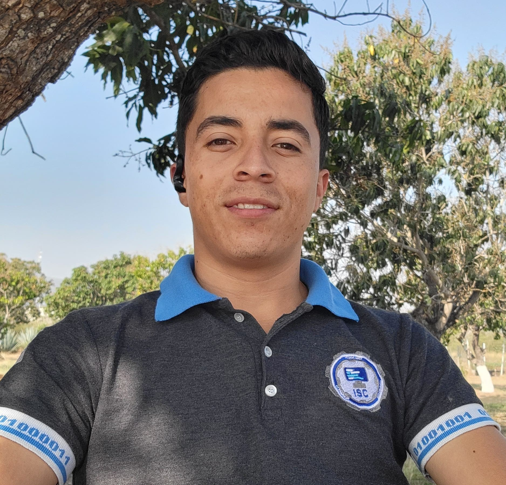

# Proyecto Educativo Consultora

Este documento detalla el proyecto educativo propuesto por la consultora XYZ, el cual consiste en la creación de un sitio web educativo para difundir material específico de la asignatura de Fundamentos de Programación. El sitio web se construirá siguiendo estándares de diseño web y se documentará cada etapa del proceso de creación.

## Objetivo del Proyecto

El objetivo principal de este proyecto es proporcionar un recurso educativo en línea que sirva como complemento a la enseñanza de la asignatura de Fundamentos de Programación. El sitio web estará diseñado para ser accesible, usable y atractivo visualmente, con el fin de facilitar el aprendizaje de los estudiantes y fomentar su interés en la programación.

## Estructura del Sitio Web

El sitio web estará dividido en las siguientes secciones principales:

1. **Misión, Visión o Propósito del Sitio**: En esta sección se establecerá la misión, visión o propósito del sitio web, delineando claramente los objetivos que se buscan alcanzar con su creación.

2. **Conoce al Equipo**: Aquí se presentará al equipo detrás del proyecto, destacando la experiencia y habilidades de cada miembro.

3. **Bibliografía**: Esta sección contendrá material y documentos relacionados con la temática de Fundamentos de Programación. Cada documento estará acompañado de una descripción y una imagen para referenciarlo con un hipervínculo.

4. **Materiales Multimedia**: Se incluirán vídeos, presentaciones y actividades interactivas relacionadas con temas específicos de la asignatura.

5. **Contacto**: Se proporcionará información de contacto para que los usuarios puedan comunicarse con el equipo del sitio web en caso de consultas o comentarios.

## Proceso de Desarrollo

El desarrollo del sitio web seguirá las siguientes etapas:

1. **Diseño Responsivo**: El sitio web se diseñará siguiendo los estándares de diseño responsivo establecidos por el W3C, garantizando una experiencia de usuario óptima en diferentes dispositivos y tamaños de pantalla.

2. **Usabilidad**: Se prestará especial atención a la usabilidad del sitio web, asegurándose de que los usuarios puedan navegar y encontrar fácilmente la información que están buscando.

3. **Accesibilidad**: Se seguirán las pautas de accesibilidad del W3C para garantizar que el sitio web sea accesible para todos los usuarios, incluyendo aquellos con discapacidades.

4. **Diseño Visual**: Se cuidará la tipografía, el color, el contraste, el espacio en blanco y la organización visual del sitio web, siguiendo principios de diseño web y considerando la psicología del color y las mejores prácticas de diseño.

5. **Consistencia**: Se mantendrá una consistencia visual en todo el sitio web, asegurando que los elementos de diseño sean coherentes en todas las páginas.

6. **Carga Rápida**: Se optimizará el rendimiento del sitio web para garantizar tiempos de carga rápidos y una experiencia de usuario fluida.

## Integrantes del Equipo

El equipo detrás del proyecto educativo de la consultora XYZ está conformado por profesionales con habilidades complementarias que trabajan en conjunto para lograr los objetivos del proyecto. A continuación, se presentan los integrantes del equipo:

1. **Naida Judith Molina Alvarez**
   - Rol: Scrum Master
   - 

2. **Gilberto Kevin Vazquez Rivera**
   - Rol: Desarrollador Frontend
   - 

3. **Jose Manuel Mejia Velazquez**
   - Rol: Diseñador UX/UI
   - 

4. **Javier Alviso Rivera**
   - Rol: Documentador
   - 

5. **Norberto Serna Rivera**
   - Rol: Documentador
   - 

6. **Juan Samuel Perez Gonzalez**
   - Rol: Desarrollador Frontend, Diseñador UX/UI
   - 

7. **Alejandro Del Castillo Díaz**
   - Rol: Por determinar
   - 